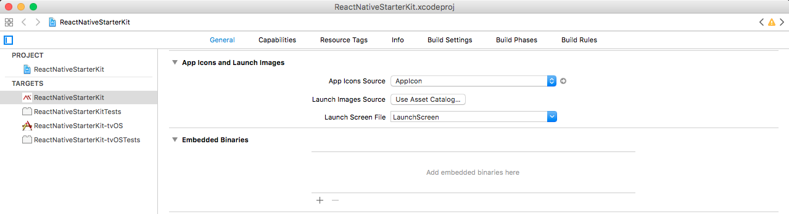
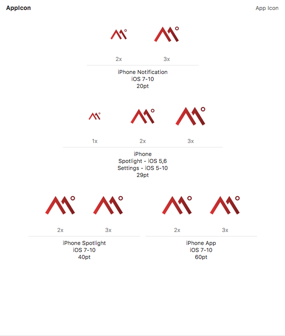
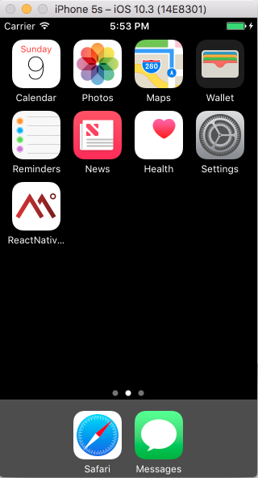

# App Icon

## iOS
There are two points that you need to know before setting up the iOS icons:

1. iOS app icons can't have transparent backgrounds. But if you do, it will automatically change to black.

2. Keep icon corners square because iOS also applies a rounded corner mask to your icon.

**First step**: You just need to put the icons inside this folder: `project/ios/project/Images.xcassets/AppIcon.appiconset/`.

The table below shows sizes required to iPhone icons:

| Size | Resolution |
|------|------------|
| 20   | @2x        |
| 20   | @3x        |
| 29   | @1x        |
| 29   | @2x        |
| 29   | @3x        |
| 40   | @2x        |
| 40   | @3x        |
| 60   | @2x        |
| 60   | @3x        |

Check out in this project the [assets/images/AppIcon.appiconset](assets/images/AppIcon.appiconset), there you will find the icons.

**Second step**: You need to setup the Contents.json file, where is set the name and resolution to each kind of icon. The file has already been configured, just move the Contents.json to your project.

After that, just open your Xcode and verify if these icons seem like those, click arrow button.

The result on Xcode should be like that:

The result on iPhone should be like that:

## Android

The Android configuration is very easy, just open the folder [project/android/app/src/main/res/](project/android/app/src/main/res/) and there you will find some folders where all you have to do is override each icon as necessary. The sizes are:

| Name   | Size    |
|--------|---------|
| hdpi   | 72x72   |
| mdpi   | 48x48   |
| xhdpi  | 96x96   |
| xxhdpi | 144x144 |
