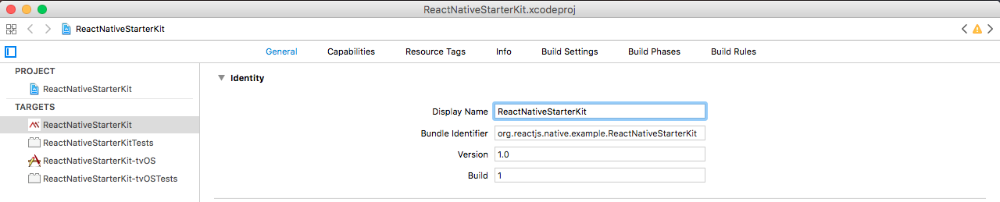
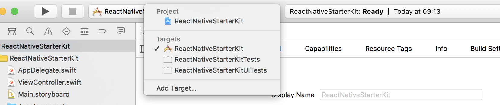

# Change app name

## iOS
Open Xcode and select ReactNativeStarterKit as your target, click on General tab and type your app name on Display Name field.



By default a target may or may not be selected, if not you just need to select it.



## Android
Update `app_name` value on `android/app/src/main/res/values/strings.xml` file.

```
<resources>
    <string name="app_name">My new app name</string>
</resources>
```
