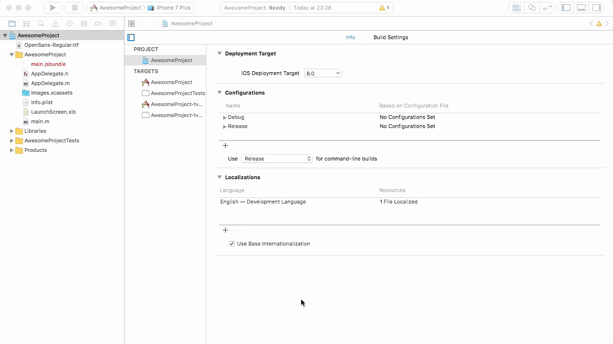

# Disable app rotation setup

This configuration will disable your app rotation over all screens for both the landscape and upside down modes. If you are looking for a way to manage the screens using a different approach, check out [react-native-rotation](https://github.com/yamill/react-native-orientation).

## iOS

1. Open your project on Xcode, select your default target, scroll down until Deployment Info and only keep selected the Portrait option.



2. Recompile.

## Android

1. Open `android/app/src/main/AndroidManifest.xml` and add a new attribute `android:screenOrientation="portrait"` in the `"android:name=".MainActivity"` of the activity tag. It should look like this:

```
<activity
	android:name=".MainActivity"
	android:label="@string/app_name"
	android:screenOrientation="portrait"
	android:configChanges="keyboard|keyboardHidden|orientation|screenSize"
	android:windowSoftInputMode="adjustResize">
...
```

2. Recompile.