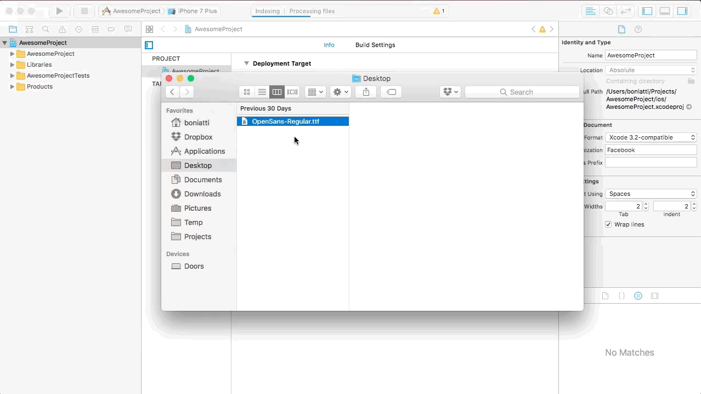

# Fonts

React Native supports TTF and OTF fonts extensions.

## iOS

1. Open your project on Xcode, drop your font file inside your project and add to the targets of your project.



2. Set up the font in the `Info.plist` file, just open it, add a new row called "Fonts provided by application" and add your fonts as an item.


3. Add the font family as a value of your styles:

```
const styles = StyleSheet.create({
  title: {
    fontFamily: 'Open Sans',
  },
});
```

4. Recompile the application.

## Android

1. Paste your fonts file inside `android/app/src/main/assets/fonts/` folder. If your font isn't regular, you must add the `-weight` in its filename, like `OpenSans-Bold.ttf`.

2. Add the font family as a value of your styles:
```
const styles = StyleSheet.create({
  title: {
    fontFamily: 'Open Sans',
  },
});
```

3. Recompile the application.
